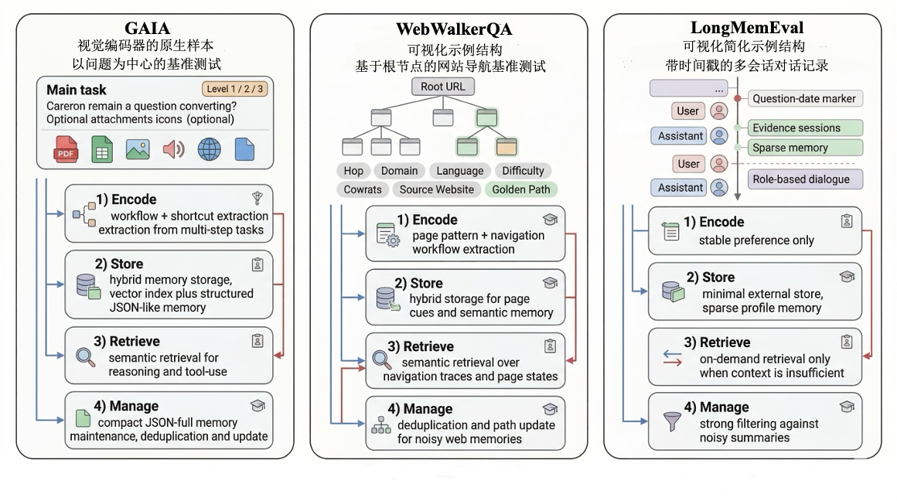
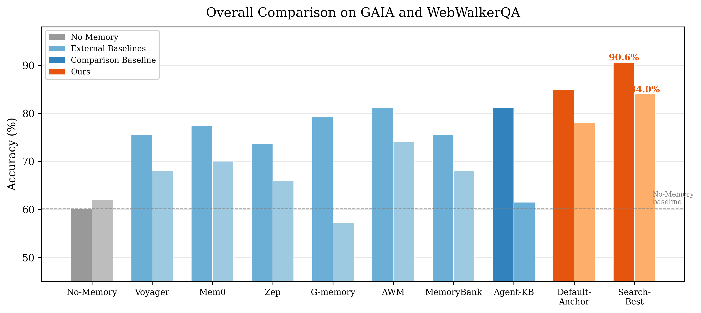

<div align="center">

# EvolveLab: Modular Long-Term Memory Framework for LLM Agents

**Exploring the Evolution of Long-Term Memory Systems for Large Language Model Agents**

*ECNU Undergraduate Thesis, 2026*

[](https://www.python.org/)
[](LICENSE)
[](https://openai.com)

</div>

---

## Overview

Existing long-term memory systems for LLM agents tightly couple memory writing, storage, retrieval, and management, making it difficult to replace components, compare alternatives, or systematically evaluate module contributions. **EvolveLab** addresses this by decomposing the memory lifecycle into four orthogonal modules and providing a unified framework for configuration search and analysis.

<div align="center">
  
  <br/>
  <sub>Four-module memory pipeline applied to three evaluation benchmarks: GAIA, WebWalkerQA, and LongMemEval.</sub>
</div>

### Key Contributions

1. **Composable 4-Module Framework** &mdash; Orthogonally decouples memory into **Encode &rarr; Store &rarr; Retrieve &rarr; Manage**, with interchangeable atomic operations per module (5 encoding presets, 5 storage backends, 7 retrieval strategies, 16 management operations).

2. **Hierarchical Feedback Search** &mdash; A multi-stage search method that screens out inefficient candidates via proxy evaluation and identifies relatively better configurations through validation, reducing search cost by **74.5%** compared to brute-force enumeration.

3. **Unified Evaluation & Ablation** &mdash; A systematic protocol covering overall comparison, module-level ablation, interaction-effect analysis, base-model impact, and cross-task generalization across **GAIA**, **WebWalkerQA**, and **LongMemEval**.

---

## Results

Our Search-Best configuration achieves **90.6%** on GAIA and **84.0%** on WebWalkerQA, outperforming all baselines including Voyager, Mem0, Zep, G-memory, AWM, MemoryBank, and Agent-KB.

<div align="center">
  
  <br/>
  <sub>Overall comparison on GAIA (Level-1, 53 tasks) and WebWalkerQA (50 tasks). Search-Best surpasses the No-Memory baseline by +11.4pp and +12.0pp respectively.</sub>
</div>

<br/>

| Method | GAIA | WebWalkerQA | Tokens | Latency |
|:-------|:----:|:-----------:|:------:|:-------:|
| No-Memory | 60.2% | 62.0% | 481K | 210s |
| AWM | 81.1% | 74.0% | 488K | 218s |
| Agent-KB | 81.1% | 61.5% | 512K | 234s |
| **Default-Anchor** | 84.9% | 78.0% | 571K | 259s |
| **Search-Best** | **90.6%** | **84.0%** | 442K | 226s |

> Search-Best = `workflow_shortcut / hybrid / semantic / json_full`

---

## Architecture

```
EvolveLab/
├── memory_schema.py          # MemoryUnit: unified atomic memory representation
├── storage/                  # Storage backends
│   ├── json_storage.py       #   JSON-based flat storage
│   ├── vector_storage.py     #   Dense vector index (FAISS)
│   ├── hybrid_storage.py     #   JSON + vector dual index
│   ├── graph_storage.py      #   Three-layer directed graph (NetworkX)
│   └── llm_graph_storage.py  #   Graph + LLM entity/fact extraction
├── retrieval/                # Retrieval strategies
│   ├── semantic_retriever.py #   Dense embedding similarity
│   ├── keyword_retriever.py  #   BM25 / TF-IDF keyword matching
│   ├── hybrid_retriever.py   #   Semantic + keyword fusion
│   ├── contrastive_retriever.py  # Query-aware contrastive ranking
│   └── graph_retriever.py    #   Graph traversal + embedding
├── management/               # Memory lifecycle operations
│   ├── ops/                  #   16 pluggable operations
│   ├── pipeline.py           #   Orchestrator (post-task / periodic / on-insert)
│   └── presets.py            #   4 preset pipelines
└── providers/                # Memory provider implementations
    ├── modular_memory_provider.py  # Core: wires storage + retrieval + management
    ├── voyager_memory_provider.py  # Baseline: Voyager-style
    ├── agent_kb_provider.py        # Baseline: Agent-KB
    └── ...                         # 12+ provider implementations
```

---

## Quick Start

### 1. Environment Setup

```bash
conda create -n memevolve python=3.10 -y
conda activate memevolve
pip install -r requirements.txt
```

### 2. Configuration

```bash
cp .env.example .env
# Fill in your API keys:
#   OPENAI_API_KEY    — LLM inference
#   SERPER_API_KEY    — Web search
#   HF_TOKEN          — Dataset download
```

### 3. Download Datasets

```bash
python scripts/data/download_gaia.py
python scripts/data/download_webwalkerqa.py
python scripts/data/download_longmemeval.py
```

### 4. Run Evaluation

```bash
# Single configuration evaluation on GAIA
python scripts/eval/run_flash_searcher_mm_gaia.py \
  --infile data/gaia/validation/metadata.jsonl \
  --memory_provider modular \
  --enable_memory_evolution \
  --shared_memory_provider \
  --model gpt-5

# Architecture search (hierarchical feedback search)
bash scripts/search/run_adaptive_search.sh
```

### 5. Run Tests

```bash
python -m pytest tests/ -v
```

---

## Module Configuration

Each module supports multiple interchangeable operations:

| Module | Options | Env Variable |
|:-------|:--------|:-------------|
| **Encode** | `insight_tip`, `trajectory_only`, `workflow_shortcut`, `mixed_all` | `MODULAR_ENABLED_PROMPTS` |
| **Store** | `json`, `vector`, `hybrid`, `graph`, `llm_graph` | `MODULAR_STORAGE_TYPE` |
| **Retrieve** | `semantic`, `keyword`, `hybrid`, `contrastive`, `graph` | `MODULAR_RETRIEVAL_TYPE` |
| **Manage** | `none`, `lightweight`, `json_basic`, `json_full`, `graph_full` | `MODULAR_MANAGEMENT_PRESET` |

Example: run a specific configuration via environment variables:

```bash
MODULAR_ENABLED_PROMPTS="workflow,shortcut" \
MODULAR_STORAGE_TYPE="hybrid" \
MODULAR_RETRIEVAL_TYPE="semantic" \
MODULAR_MANAGEMENT_PRESET="json_full" \
python scripts/eval/run_flash_searcher_mm_gaia.py --memory_provider modular ...
```

---

## Repository Structure

```
.
├── EvolveLab/              # Core: 4-module memory framework
├── FlashOAgents/           # Agent runtime (DAG parallel execution)
├── experiments/
│   ├── configs/            # Experiment configurations (search, ablation)
│   ├── scripts/            # Search & evaluation orchestrators
│   └── common/             # Shared utilities
├── prompts/                # 6 memory extraction prompt templates
├── scripts/
│   ├── eval/               # Evaluation entry points
│   ├── search/             # Architecture search launchers
│   └── data/               # Dataset downloaders
├── tests/                  # Unit tests (104 cases)
├── .env.example            # Configuration template
└── requirements.txt        # Dependencies
```

---

## Citation

If you find this work useful, please cite:

```bibtex
@thesis{dl2026memevolve,
  title   = {Exploring the Evolution of Long-Term Memory Systems for Large Language Model Agents},
  author  = {Lin Du},
  school  = {East China Normal University},
  year    = {2026},
  type    = {Bachelor's Thesis}
}
```

---

## Acknowledgments

This project builds upon [Flash-Searcher](https://arxiv.org/abs/2509.25301) as the agent execution framework. We thank the authors for their open-source contribution.

## License

[Apache License 2.0](LICENSE)
